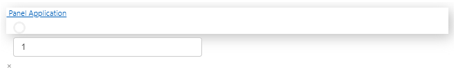

# repro-panel-param-vscode-notebook-pn-template-no-reactivity

[VS Code + notebook setup, Panel + Param, no reactivity when using `pn.template` · Issue #6888 · holoviz/panel](https://github.com/holoviz/panel/issues/6888)

1\. Install dependencies:

```
$ poetry install
```

If you are not using poetry, you might use `requirements.txt`. However, this is not recommended as the sources of truth are `pyproject.toml` and `poetry.lock`.

2\. Open the project in VS Code (if you haven't done so yet), open and run `repro.ipynb`. Enter "1" in the displayed text input. Observe value also being printed below ✅


4\. Comment out `text` at the end of the cell and uncomment `pn.template.VanillaTemplate(main=[text])`. Re-run the cell.  Enter "1" in the displayed text input and observe that nothing is printed.  You can also add something like `assert False` into the `_update` function to make sure that it is never called.


